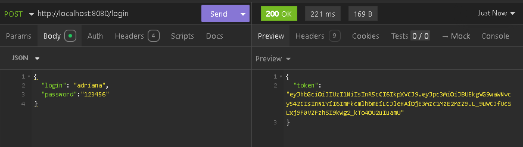
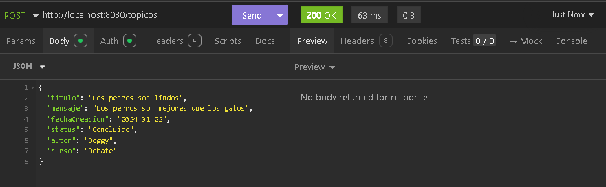
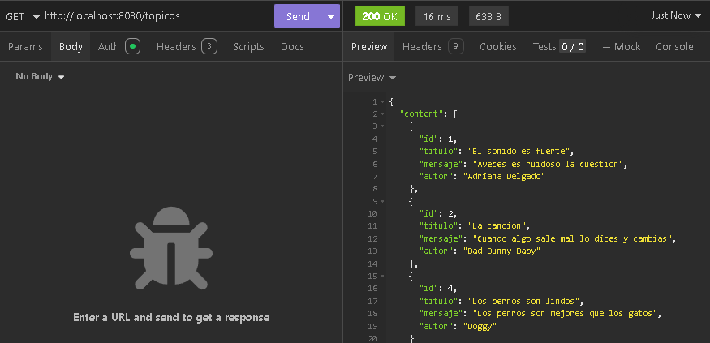
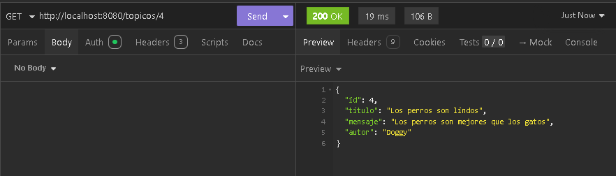
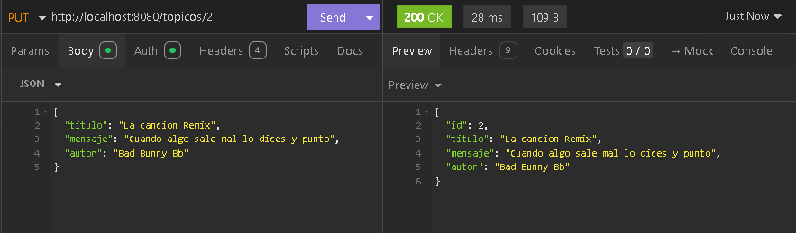
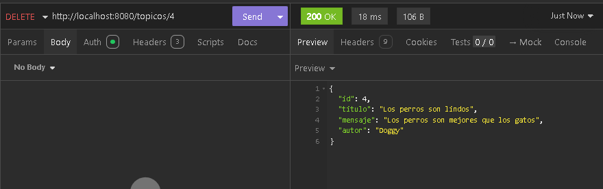
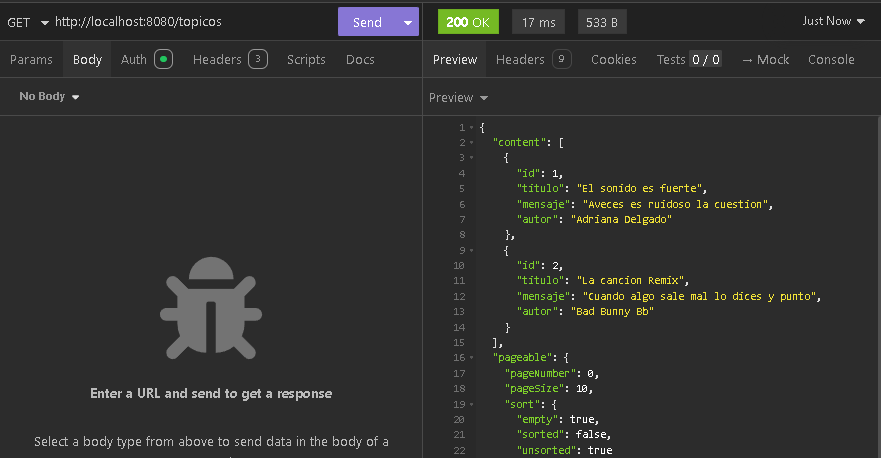

---

# ForoHub - API de Gestión de Tópicos

---

## 🔖 Descripción del Proyecto
ForoHub es una API desarrollada para gestionar tópicos en un foro. Permite registrar, listar, actualizar y eliminar tópicos. Además, incluye un sistema de autenticación mediante tokens JWT para garantizar la seguridad en las operaciones. Este proyecto fue realizado con Alura Latam.

---

## 💻 Funcionalidades
- **Gestión de Tópicos**:
  - Registrar nuevos tópicos.
  - Listar tópicos activos con paginación.
  - Obtener detalles de un tópico específico por ID.
  - Actualizar información de un tópico existente.
  - Desactivar (eliminar lógicamente) un tópico.
- **Autenticación**:
  - Sistema de inicio de sesión que genera tokens JWT para la autenticación segura.

---

## 🛠️ Tecnologías Utilizadas
- **Lenguaje**: Java 17
- **Framework**: Spring Boot
- **Base de Datos**: JPA y Hibernate
- **SQL**: MySql
- **Autenticación**: JWT (JSON Web Tokens)
- **Validación**: Jakarta Validation
- **Documentación**: Swagger con OpenAPI 3.0

---

## ✨ Conclusiones
ForoHub es una solución robusta para la gestión de tópicos en un entorno de foros en línea. Su arquitectura está diseñada para garantizar la seguridad, escalabilidad y facilidad de uso. La integración de JWT asegura que las operaciones sean realizadas únicamente por usuarios autenticados.

---
## 🎞 Demostración

---
